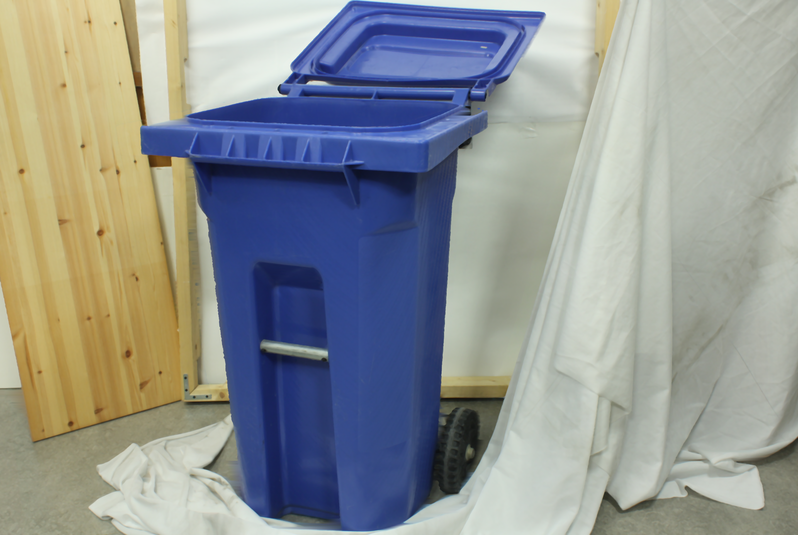
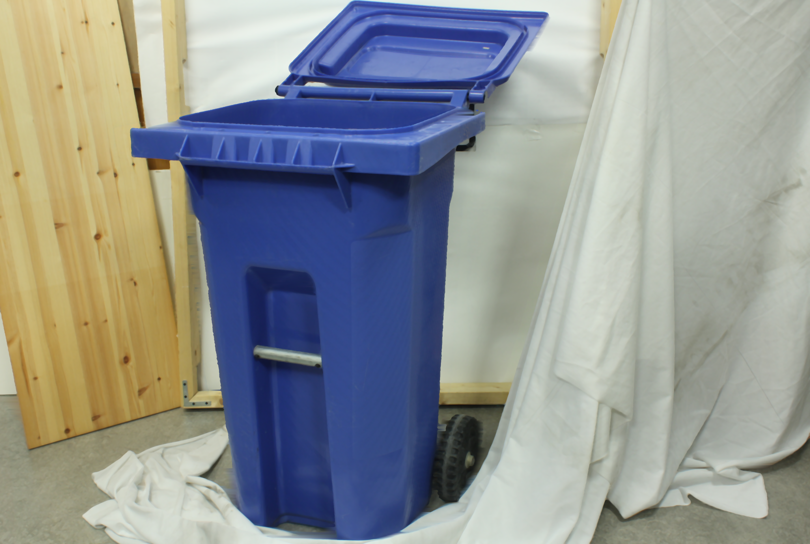
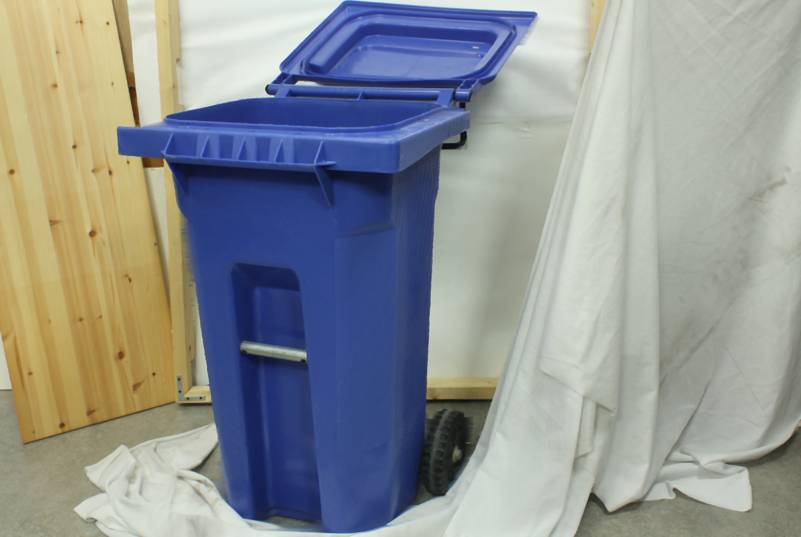
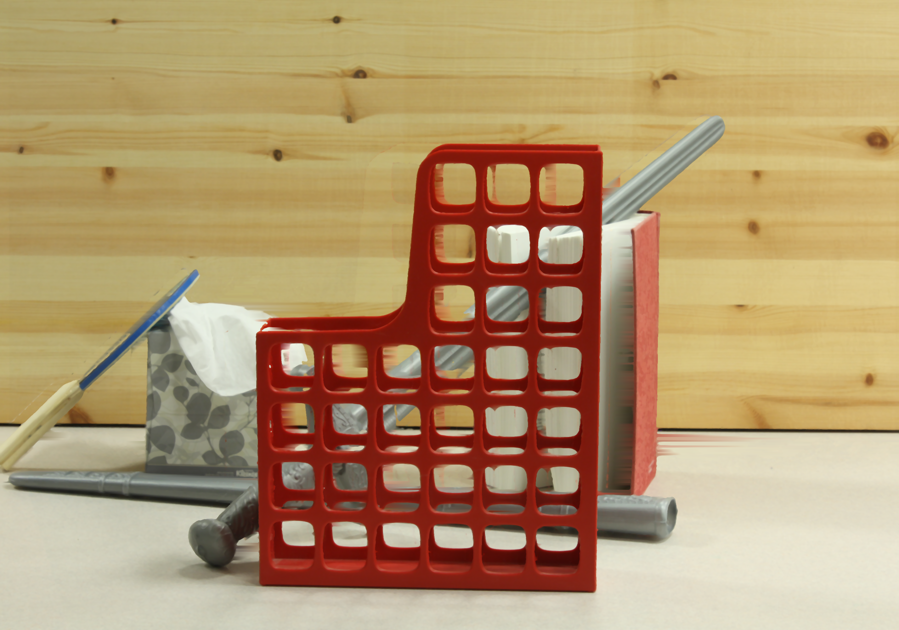
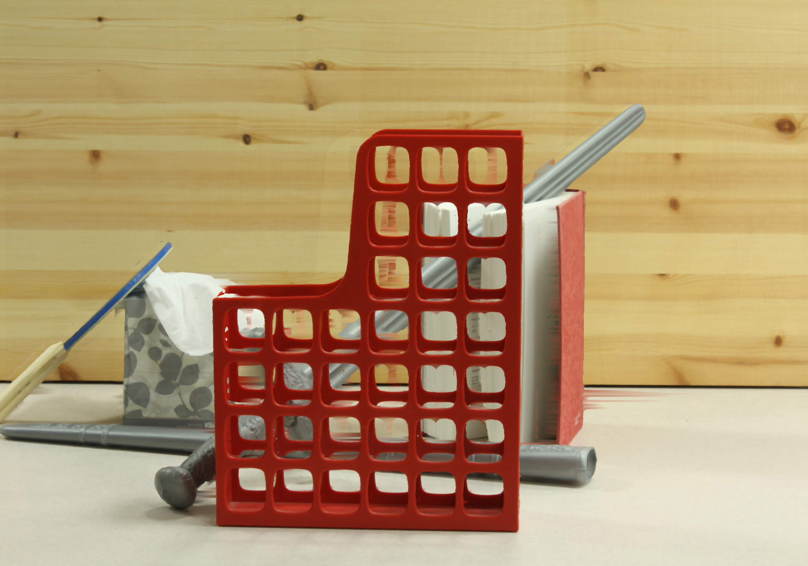
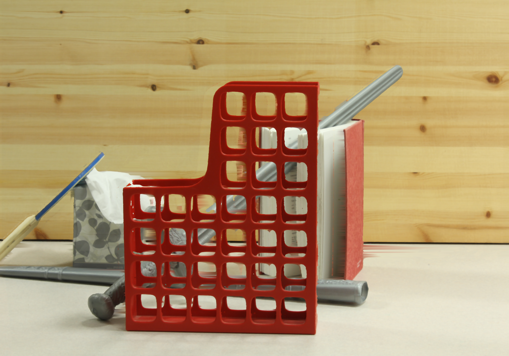
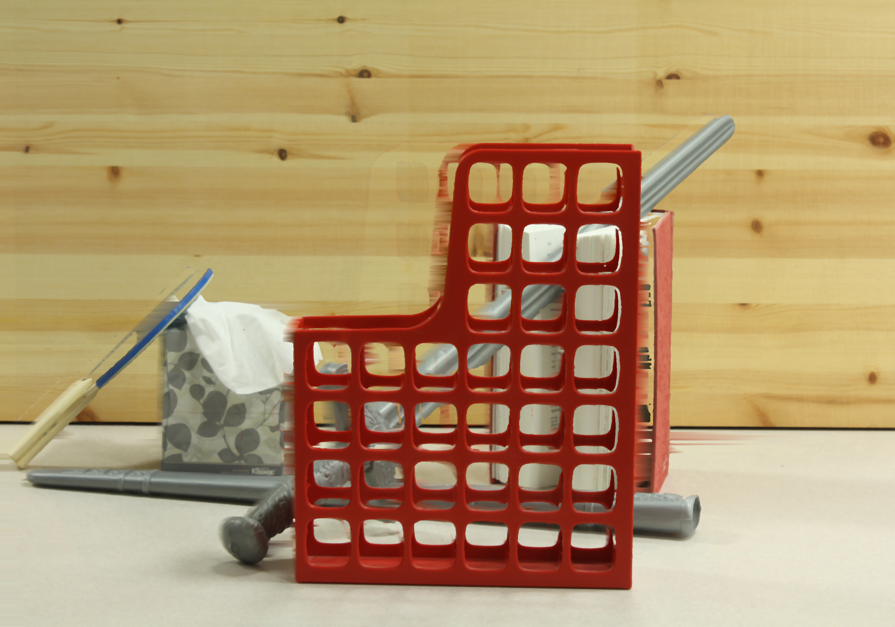
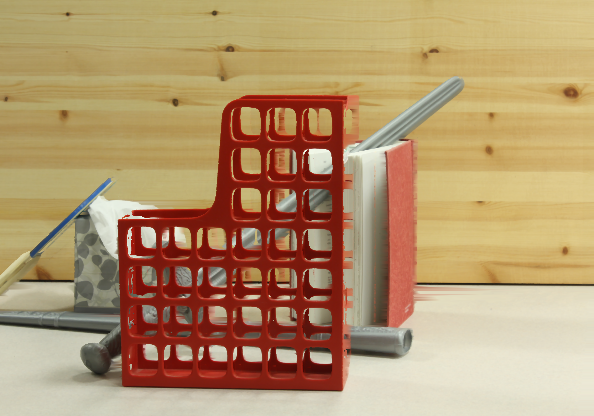

# Depth Reprojection
The goal of this project is to take depth map and RGB pairs to synthesize an image from a new view. 

The [Middlebury stereo dataset](https://vision.middlebury.edu/stereo/data/scenes2014/) is used to test the implementation of the algorithm. Each dataset consists of: 
* calib.txt: camera calibration information
* disp0,1.pfm: left and right ground truth disparities 
* im0,1.png: left and right view

#### How To Run:
python main.py -d \<relative path to dataset\> -x \<x-shift\> -v \<video generation>

## Method

The pipeline synthesizes a new view from two rectified stereo images and their disparity maps.

1. **Depth from disparity**  
   Depth is computed as z = (b * f) / (d + doffs), where \(b\) is the baseline, \(f\) the focal length, and \(d\) the disparity.

2. **Forward warp with 2×2 bilinear splatting**  
   For each source pixel, the target coordinates are  
   x' = x - d * (x_pos - s),  
   y' = y,  
   with s in {0,1} for left/right. Instead of writing to a single pixel, each source sample is **splatted** into a **2×2** neighborhood around the floored (x', y'), with bilinear weights w = (1-f_x)(1-f_y), f_x(1-f_y), (1-f_x)f_y, and f_x f_y for the four cells, where f_x, f_y are the fractional parts of x', y'. This 2×2 splatting reduces aliasing and hole patterns compared to point splatting.

3. **Occlusion (z-buffer)**  
   A z-buffer keeps the closest depth per pixel. Pixels at similar depth are blended; a new closer surface resets the accumulation for that pixel.

4. **Hole filling**  
   - **X-shift:** For each row, extend the leftmost/rightmost valid pixel to the edges, and linearly interpolate in between valid pixels.

5. **Post-processing**  
   A 7×7 median blur is applied to reduce noise.

## Results
### Interpolation 

|   1/4 from Left     | Halfway between the views       |    3/4 from Left    |
|--------|--------|--------|
|  |  |  |
|  |  |  |
|  |  |  |

### Extrapolation 
| 1/4 outside from Left | 1/4 outside from Right |
|--------------------|---------------------|
|  |  |
|         |         |

More images of synthesized views are under ./results/interpolation and ./results/extrapolation. 

### Video 
I generated a video that connects frames ranging from -0.3 to 1.3 with a step of 0.1. This simulates a motion of viewing the scene from left to right. 

https://github.com/user-attachments/assets/899648f2-3df2-4fe3-a478-32a19a2f9288

https://github.com/user-attachments/assets/9801ff43-f1e0-48fa-8a3e-422d9898d47c

https://github.com/user-attachments/assets/9bb9a2c2-701d-42f3-9b04-d0cd290772a3

https://github.com/user-attachments/assets/7a20ca66-fae7-433d-aeb1-84fad4687152

## Limitations
Although the median blur helped smooth out the irregular noises, there still exists a lot of horizontal streaks in both the interpolation and extrapolation images. I account for the depth of the foreground and the background using the z-buffer, but a more sophisticated approach to distinguish the front and back could help with the streaks. Also, a different interpolation to select the color for the holes could help. Specifically for extrapolation, since we don't have the information outside the two views, it is difficult to accurately create the new views. Moreover, diagonal streaks were created on parts of the image with a solid color like the wall. I was able to reduce the intensity of the artifact by doing a 2x2 bilinear splatting instead of a single pixel splatting, but there are still visible diagonal lines. (This can be clearly seen in the playroom image)
